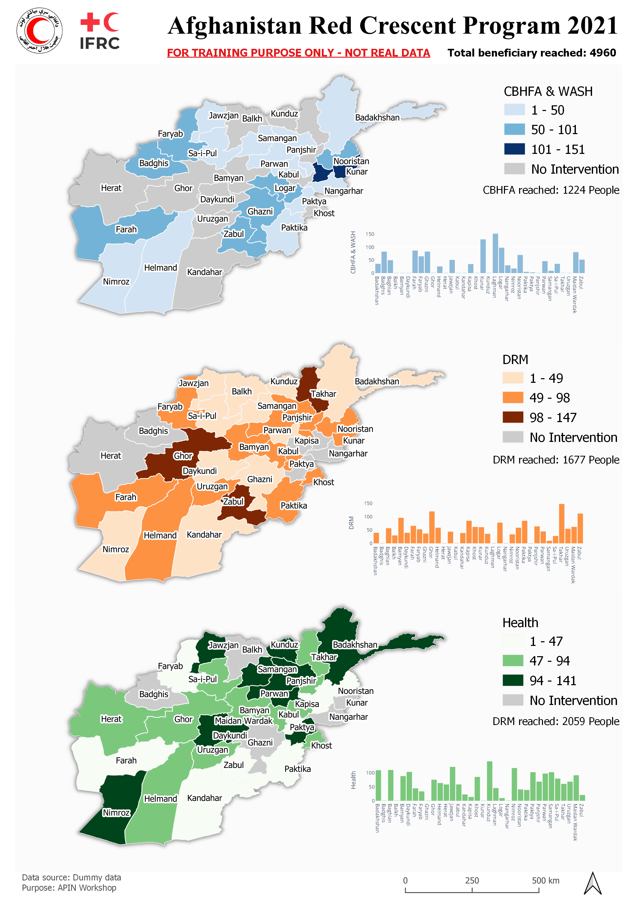

# APIN QGIS Workshop 
#### Date: 21-07-2021

Short workhop on how to use QGIS to visualize data  

## Basic QGIS Orientation
Orientation on QGIS user interface such as:
1. Menu bar
2. Toolbar
3. Layer panel
4. Processing toolbox
## Data management
Make use of QGIS geopackage (.gpkg) to store geo files and project
## Data Exploration
Prepare the data using Spreadsheet software, pivoting and proceed to join table operation.
## Plugins
Using Spreadsheet plugin to import raw data into QGIS. Installing DataPlotly for simmple charting
## Join Table
Join non-spatial data to existing spatial data
## Choropleth Map
Play with map style to do choropleth map
## Map Theme
Arrange map visual according theme and to be used in QGIS map composer
## Masking
Create outer boundary/island effect by dissolve geo processing operation
## QGIS Composer Orientation
Basic know how where the buttons are
## Map Layouting
Arranging map and follow map theme and adding map legend, compass and scale bar
## DataPlotly
Using DataPlotly to create nice bar chart
## Data Aggregate
Sum total data depend on layer and filed data
